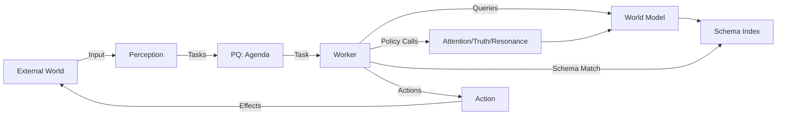

# **SeNARS+ Final: Complete Implementable Specification**

## **1. Core Architecture**



**Concurrency Model**: N worker threads sharing Agenda and WorldModel (thread-safe)

## **2. Complete Data Model**

### **2.1. Primitive Types**
```python
UUID = str  # 32 hex chars + dashes (RFC 4122)
Timestamp = float  # Unix timestamp in seconds
Vector = list[float]  # Fixed-length semantic embedding
```

### **2.2. SemanticAtom (Immutable)**
```python
class SemanticAtom:
    id: UUID
    content: str  # S-Expression (see syntax below)
    embedding: Vector
    meta: dict[str, any] = {}  # Optional metadata

    # Content syntax:
    #   Standard: "(cat --> mammal)" | "(implies (eats X chocolate) (is_sick X))"
    #   Scope: "{(%a, %b=0.0), body1, body2...}" 
    #   Executable: "{(%a), (execute handler params)}"
```

### **2.3. Task (Mutable Context)**
```python
class TruthValue:
    frequency: float  # 0.0-1.0
    confidence: float  # 0.0-1.0

class AttentionValue:
    priority: float  # >0.0, higher = more urgent
    durability: float  # >0.0, higher = longer retention

class DerivationStamp:
    timestamp: Timestamp
    parent_ids: list[UUID]  # Source task IDs
    schema_id: UUID  # Schema used (UUID of SemanticAtom)
    scope_bindings: dict[str, str] | None = None  # {"%a": "value"}

class Task:
    id: UUID
    atom_id: UUID  # References SemanticAtom
    type: Literal['BELIEF', 'GOAL', 'QUESTION', 'QUEST']
    truth: TruthValue | None  # Required if type == BELIEF
    attention: AttentionValue
    stamp: DerivationStamp
```

## **3. Core Interfaces (Complete Contracts)**

### **3.1. IAttentionPolicy**
```python
class IAttentionPolicy(ABC):
    @abstractmethod
    def calculate_initial(self, task: Task) -> AttentionValue:
        """Initial attention for newly perceived tasks"""
        # PRE: task.stamp.parent_ids is empty
        # POST: result.priority > 0, result.durability > 0

    @abstractmethod
    def calculate_derived(self, 
                          task_a: Task, 
                          task_b: Task, 
                          schema_id: UUID) -> AttentionValue:
        """Attention for derived tasks"""
        # PRE: task_a and task_b have valid stamps
        # POST: result.priority > 0, result.durability > 0

    @abstractmethod
    def decay(self, task: Task, elapsed: float) -> AttentionValue:
        """Apply time-based decay (elapsed in seconds)"""
        # PRE: elapsed >= 0
        # POST: result.priority <= task.attention.priority
        # POST: result.durability <= task.attention.durability
```

### **3.2. ITruthPolicy**
```python
class ITruthPolicy(ABC):
    @abstractmethod
    def revision(self, 
                 belief_a: Task, 
                 belief_b: Task) -> TruthValue:
        """Merge two beliefs about same content"""
        # PRE: belief_a and belief_b are BELIEF type
        # PRE: they reference same SemanticAtom.content
        # POST: 0 <= result.frequency <= 1
        # POST: 0 <= result.confidence <= 1

    @abstractmethod
    def derivation(self,
                   premise_a: Task,
                   premise_b: Task,
                   schema_id: UUID) -> TruthValue:
        """Calculate truth of derived conclusion"""
        # PRE: premise_a and premise_b are valid tasks
        # PRE: schema_id references valid schema
        # POST: 0 <= result.frequency <= 1
        # POST: 0 <= result.confidence <= 1
```

### **3.3. IResonanceStrategy**
```python
class IResonanceStrategy(ABC):
    @abstractmethod
    def find_context(self,
                     focus: Task,
                     world_model: 'WorldModel',
                     k: int,
                     scope_bindings: dict[str, str] | None = None) -> list[Task]:
        """Find k most relevant context tasks"""
        # PRE: k > 0
        # POST: len(result) <= k
        # POST: all tasks in result are from world_model
```

### **3.4. ICognitiveSchema**
```python
class ICognitiveSchema(ABC):
    @property
    @abstractmethod
    def id(self) -> UUID:
        """Unique schema identifier (UUID of its SemanticAtom)"""
        
    @abstractmethod
    def get_trigger_pattern(self) -> str:
        """Pattern for matching against task content"""
        # RETURNS: S-Expression pattern with variables ($1, $2)
        # EXAMPLE: "(implies $1 $2)" for deduction schema
        
    @abstractmethod
    def apply(self,
              task_a: Task,
              task_b: Task,
              truth_policy: ITruthPolicy) -> list[Task]:
        """Apply schema to generate new tasks"""
        # PRE: tasks match trigger pattern
        # POST: all returned tasks have valid stamps
        # POST: BELIEF tasks have truth values
```

## **4. World Model Specification**

```python
class WorldModel:
    def __init__(self, resonance: IResonanceStrategy):
        self.resonance = resonance
        self.atoms: dict[UUID, SemanticAtom] = {}  # Atom ID → Atom
        self.tasks: dict[UUID, Task] = {}  # Task ID → Task
        self.semantic_index: VectorDB = VectorDB()  # embedding → atom_id
        self.symbolic_index: dict[str, list[UUID]] = defaultdict(list)
        self.schema_index: PatternMatcher = PatternMatcher()
        
    def add_atom(self, atom: SemanticAtom) -> None:
        """Add atom, update indexes"""
        self.atoms[atom.id] = atom
        self.semantic_index.add(atom.embedding, atom.id)
        self.symbolic_index[atom.content].append(atom.id)
        
        # Register schemas
        if is_schema_pattern(atom.content):
            self.schema_index.add(atom.content, atom.id)
    
    def add_task(self, task: Task) -> None:
        """Add task, handle BELIEF revision if needed"""
        if task.type == 'BELIEF':
            existing = self.find_belief(task.atom_id)
            if existing:
                task.truth = self.truth_policy.revision(existing, task)
                self.tasks[existing.id] = task
            else:
                self.tasks[task.id] = task
        else:
            self.tasks[task.id] = task
    
    def find_belief(self, atom_id: UUID) -> Task | None:
        """Find existing BELIEF for this atom"""
        for task in self.tasks.values():
            if task.type == 'BELIEF' and task.atom_id == atom_id:
                return task
        return None
    
    def find_resonant(self, focus: Task, k: int) -> list[Task]:
        """Find k most resonant tasks"""
        return self.resonance.find_context(focus, self, k)
    
    def find_schemas(self, task_a: Task, task_b: Task) -> list[ICognitiveSchema]:
        """Find schemas applicable to task pair"""
        atom_a = self.get_atom(task_a.atom_id)
        atom_b = self.get_atom(task_b.atom_id)
        schema_ids = self.schema_index.match(atom_a.content, atom_b.content)
        return [SchemaRegistry.get(schema_id) for schema_id in schema_ids]
    
    def get_atom(self, atom_id: UUID) -> SemanticAtom:
        return self.atoms[atom_id]
    
    def get_task(self, task_id: UUID) -> Task:
        return self.tasks[task_id]
```

## **5. Scope Syntax & Semantics (Complete Specification)**

### **5.1. Scope Grammar (EBNF)**
```
scope        = "{" variables "," body {"," body} "}"
variables    = "(" [variable {"," variable}] ")"
variable     = "%" identifier ["=" default]
body         = s_expr | string_literal
string_literal = "(. " quoted_string ")"
identifier   = letter {letter | digit | "_"}
default      = quoted_string | number
```

### **5.2. Examples**
```
# Simple scope
{(%x), (is_toxic %x cat)}

# Scope with defaults
{(%substance, %animal=cat), (is_toxic %substance %animal)}

# Scope with string literal
{(%x), (. "Length of %x is critical"), (length %x > 0.5)}

# Executable scope
{(%query), (execute "llm" query:%query)}
```

### **5.3. Scope Resolution Algorithm**
```python
def resolve_scope_bindings(
    task_a: Task,
    task_b: Task,
    world_model: WorldModel
) -> dict[str, str] | None:
    """Resolve variable bindings from task context"""
    atoms = [
        world_model.get_atom(task_a.atom_id),
        world_model.get_atom(task_b.atom_id)
    ]
    
    # Find scope expressions
    scope_atoms = [a for a in atoms if a.content.startswith("{")]
    if not scope_atoms:
        return None
    
    bindings = {}
    required_vars = set()
    
    for atom in scope_atoms:
        # Parse scope variables: {(%a, %b=0.0), ...}
        var_section = atom.content[1:].split(",", 1)[0] + ")"
        vars = parse_scope_vars(var_section)
        
        for var in vars:
            if var.required:
                required_vars.add(var.name)
            if var.default is not None:
                bindings[var.name] = var.default
        
        # Extract bindings from task content
        content_vars = extract_vars_from_content(atom.content)
        for var_name in content_vars:
            if var_name in bindings:
                continue  # Already bound
            
            # Try to find value from context
            value = find_binding_value(var_name, task_a, task_b, world_model)
            if value is not None:
                bindings[var_name] = value
            elif var_name in required_vars:
                return None  # Missing required binding
    
    return bindings if bindings else None

def substitute_in_content(content: str, bindings: dict[str, str]) -> str:
    """Replace %vars with bound values"""
    result = content
    for var, value in bindings.items():
        result = result.replace(var, value)
    return result
```

## **6. Cognitive Cycle (Complete Algorithm)**

```python
def worker_loop(
    agenda: PriorityQueue,
    world_model: WorldModel,
    attention_policy: IAttentionPolicy,
    truth_policy: ITruthPolicy,
    procedure_handlers: dict[str, 'ProcedureHandler']
):
    while True:
        # 1. SELECT highest priority task
        task_a = agenda.pop()
        
        # 2. RESONATE: Find context
        context = world_model.find_resonant(task_a, k=10)
        
        # 3. SCOPE RESOLUTION
        scope_bindings = resolve_scope_bindings(task_a, context, world_model)
        
        # 4. PROCESS BASED ON TASK TYPE
        if task_a.type == 'PROCEDURE':
            # Special handling for executable scopes
            results = execute_procedure(
                task_a, 
                world_model, 
                procedure_handlers, 
                scope_bindings
            )
            for task in results:
                task.stamp = DerivationStamp(
                    timestamp=time.time(),
                    parent_ids=[task_a.id],
                    schema_id=task_a.stamp.schema_id,
                    scope_bindings=scope_bindings
                )
                agenda.push(task)
            continue
        
        # 5. MATCH & DERIVE
        for task_b in context:
            schemas = world_model.find_schemas(task_a, task_b)
            for schema in schemas:
                # Apply schema (with scope if available)
                if scope_bindings:
                    derived = schema.apply_with_bindings(
                        task_a, task_b, truth_policy, scope_bindings
                    )
                else:
                    derived = schema.apply(task_a, task_b, truth_policy)
                
                # 6. INTEGRATE & ENQUEUE
                for new_task in derived:
                    # Handle procedures
                    if is_procedure_task(new_task):
                        results = execute_procedure(
                            new_task, world_model, procedure_handlers, scope_bindings
                        )
                        for result in results:
                            result.stamp = DerivationStamp(
                                timestamp=time.time(),
                                parent_ids=[new_task.id],
                                schema_id=schema.id,
                                scope_bindings=scope_bindings
                            )
                            agenda.push(result)
                        continue
                    
                    # Standard task processing
                    if new_task.type == 'BELIEF':
                        new_task.truth = truth_policy.derivation(
                            task_a, task_b, schema.id
                        )
                    new_task.attention = attention_policy.calculate_derived(
                        task_a, task_b, schema.id
                    )
                    new_task.stamp = DerivationStamp(
                        timestamp=time.time(),
                        parent_ids=[task_a.id, task_b.id],
                        schema_id=schema.id,
                        scope_bindings=scope_bindings
                    )
                    agenda.push(new_task)
        
        # 7. MEMORIZE BELIEFS
        if task_a.type == 'BELIEF':
            world_model.add_task(task_a)
```

## **7. Procedure Execution Framework**

### **7.1. Procedure Handler Interface**
```python
class ProcedureHandler(ABC):
    @abstractmethod
    def name(self) -> str:
        """Handler name (matches 'execute' calls)"""
    
    @abstractmethod
    def can_handle(self, content: str) -> bool:
        """Check if this handler can process the content"""
    
    @abstractmethod
    def execute(self,
                content: str,
                bindings: dict[str, str],
                world_model: WorldModel) -> list[Task]:
        """Execute procedure and return results"""
        # PRE: content is a valid procedure expression
        # PRE: all required bindings are present
        # POST: returned tasks have valid structure
```

### **7.2. Example: LLM Handler**
```python
class LLMHandler(ProcedureHandler):
    def name(self) -> str:
        return "llm"
    
    def can_handle(self, content: str) -> bool:
        return "(execute \"llm\"" in content
    
    def execute(self, content: str, bindings: dict, world_model: WorldModel) -> list[Task]:
        # Extract query template
        query = extract_param(content, "query")
        if not query:
            return []
        
        # Perform substitutions
        for var, value in bindings.items():
            query = query.replace(var, value)
        
        # Call LLM
        result = llm_api.query(query)
        
        # Create belief task
        atom = SemanticAtom(
            id=generate_uuid(),
            content=f"(search_result \"{query}\" \"{result.text}\")",
            embedding=generate_embedding(result.text)
        )
        world_model.add_atom(atom)
        
        return [Task(
            id=generate_uuid(),
            atom_id=atom.id,
            type='BELIEF',
            truth=TruthValue(
                frequency=0.9,
                confidence=result.confidence
            ),
            attention=AttentionValue(
                priority=0.8,
                durability=0.7
            ),
            stamp=DerivationStamp(
                timestamp=time.time(),
                parent_ids=[],
                schema_id=generate_uuid("llm_handler")
            )
        )]
```

### **7.3. Procedure Recognition & Execution**
```python
def is_procedure_task(task: Task) -> bool:
    """Check if task represents an executable procedure"""
    atom = world_model.get_atom(task.atom_id)
    return "(execute" in atom.content

def execute_procedure(
    task: Task,
    world_model: WorldModel,
    handlers: dict[str, ProcedureHandler],
    bindings: dict[str, str] | None
) -> list[Task]:
    """Execute procedure task and return results"""
    atom = world_model.get_atom(task.atom_id)
    content = atom.content
    
    # Resolve scope bindings
    if bindings:
        content = substitute_in_content(content, bindings)
    
    # Find matching handler
    handler_name = extract_handler_name(content)
    if not handler_name or handler_name not in handlers:
        return []  # No handler available
    
    # Execute
    try:
        return handlers[handler_name].execute(content, bindings or {}, world_model)
    except Exception as e:
        # Log error as a task
        error_atom = SemanticAtom(
            id=generate_uuid(),
            content=f"(execution_error \"{handler_name}\" \"{str(e)}\")"
        )
        world_model.add_atom(error_atom)
        return [Task(
            id=generate_uuid(),
            atom_id=error_atom.id,
            type='BELIEF',
            truth=TruthValue(frequency=0.0, confidence=1.0),
            attention=AttentionValue(priority=0.9, durability=0.9),
            stamp=DerivationStamp(
                timestamp=time.time(),
                parent_ids=[task.id],
                schema_id=generate_uuid("error_handler")
            )
        )]
```

## **8. Error Handling & Validation**

### **8.1. Critical Error Conditions**
| Condition | Handling |
|----------|----------|
| Missing required scope variable | Skip schema application |
| Invalid scope syntax | Treat as regular task |
| No matching procedure handler | Skip execution, log error |
| Execution timeout | Return error task with timeout info |
| Schema pattern mismatch | Skip schema application |

### **8.2. Validation Criteria for Implementations**
1. **Backward Compatibility**: Must process all original S-Expressions correctly
2. **Scope Recognition**: Must correctly identify scope expressions
3. **Variable Binding**: Must resolve bindings according to specification
4. **Execution Safety**: Procedures must execute in sandboxed environment
5. **Provenance Tracking**: All derived tasks must have complete derivation stamps
6. **Concurrency Safety**: Agenda and WorldModel must be thread-safe

## **9. Complete Worked Example**

**Input**: "My cat ate chocolate. Is it dangerous?"

**Perception Subsystem**:
```python
# Create BELIEF from input
atom1 = SemanticAtom(
    id="a1", 
    content="(eats cat chocolate)",
    embedding=embed("Cat ate chocolate")
)
task1 = Task(
    id="t1",
    atom_id="a1",
    type="BELIEF",
    truth=TruthValue(frequency=0.8, confidence=0.7),
    attention=AttentionValue(priority=0.6, durability=0.5),
    stamp=DerivationStamp(timestamp=time.time(), parent_ids=[], schema_id="")
)
agenda.push(task1)

# Create GOAL from user intent
atom2 = SemanticAtom(
    id="a2",
    content="(is_safe_for cat chocolate)"
)
task2 = Task(
    id="t2",
    atom_id="a2",
    type="GOAL",
    attention=AttentionValue(priority=0.9, durability=0.8),
    stamp=DerivationStamp(timestamp=time.time(), parent_ids=[], schema_id="")
)
agenda.push(task2)
```

**Safety Analysis Schema Activation**:
```python
# Schema detects knowledge gap and creates scoped procedure
scope_atom = SemanticAtom(
    id="a3",
    content='{(%sub=chocolate, %anim=cat), '
            '(QUESTION "(is_toxic %sub %anim)?"), '
            '(GOAL (execute "llm" query:"is %sub toxic to %anim?"))}'
)
scope_task = Task(
    id="t3",
    atom_id="a3",
    type="GOAL",
    attention=attention_policy.calculate_derived(task1, task2, "safety_schema"),
    stamp=DerivationStamp(
        timestamp=time.time(),
        parent_ids=["t1", "t2"],
        schema_id="safety_schema"
    )
)
agenda.push(scope_task)
```

**Procedure Execution**:
```python
# Worker processes scope_task
bindings = {"%sub": "chocolate", "%anim": "cat"}
resolved_content = substitute_in_content(scope_atom.content, bindings)
# Becomes: '{(chocolate, cat), (QUESTION "(is_toxic chocolate cat)?"), ...}'

# Execute the procedure part
handler = llm_handler
results = handler.execute(
    '(GOAL (execute "llm" query:"is chocolate toxic to cat?"))',
    bindings,
    world_model
)
# Returns BELIEF task with search result
```

**Final Outcome**:
```python
# BELIEF from LLM result
atom4 = SemanticAtom(
    id="a4",
    content="(is_toxic chocolate cat)",
    embedding=embed("Chocolate is toxic to cats")
)
task4 = Task(
    id="t4",
    atom_id="a4",
    type="BELIEF",
    truth=TruthValue(frequency=0.95, confidence=0.9),
    attention=AttentionValue(priority=0.85, durability=0.8),
    stamp=DerivationStamp(
        timestamp=time.time(),
        parent_ids=["t3"],
        schema_id="llm_handler",
        scope_bindings={"%sub": "chocolate", "%anim": "cat"}
    )
)
agenda.push(task4)

# Safety schema now triggers action
action_atom = SemanticAtom(
    id="a5",
    content="(send_alert user \"Cat is in danger from chocolate!\")"
)
action_task = Task(
    id="t5",
    atom_id="a5",
    type="GOAL",
    attention=AttentionValue(priority=0.95, durability=0.9),
    stamp=DerivationStamp(
        timestamp=time.time(),
        parent_ids=["t1", "t2", "t4"],
        schema_id="safety_conclusion"
    )
)
agenda.push(action_task)
```

## **10. Implementation Checklist**

- [ ] Agenda: Thread-safe priority queue implementation
- [ ] WorldModel: Complete index implementation
- [ ] Scope parser: Validates and processes scope syntax
- [ ] Variable resolver: Handles binding and substitution
- [ ] Procedure framework: Handler registration and execution
- [ ] Cognitive cycle: Full implementation of worker loop
- [ ] Policy implementations: At least one of each type
- [ ] Schema implementations: Deduction, abduction, etc.
- [ ] Error handling: All critical error conditions covered
- [ ] Validation suite: Tests for all specification points

This specification provides a complete, implementable blueprint that preserves 100% of the original SeNARS functionality while adding robust scope and procedure execution capabilities with full backward compatibility.